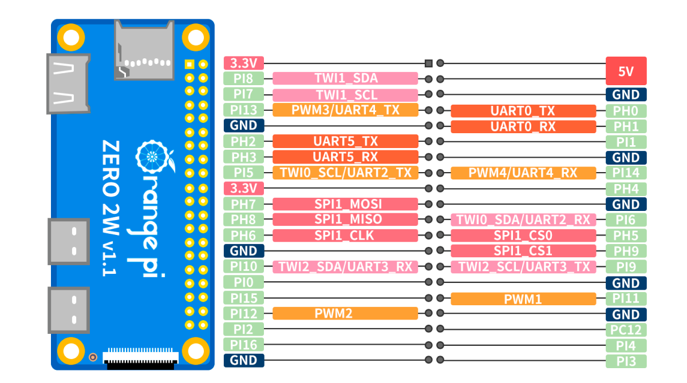

# Wiring Guide

GPIO wiring for the **Orange Pi Zero 2W** and attached peripherals.

> This guide is specific to the **Orange Pi Zero 2W**. Pin offsets and GPIO chip assignments will differ on other boards.

## Board Reference

- [Orange Pi Zero 2W — Official Hardware Page](http://www.orangepi.org/html/hardWare/computerAndMicrocontrollers/details/Orange-Pi-Zero-2W.html)



 +------+-----+----------+--------+---+  ZERO2W  +---+--------+----------+-----+------+
 | GPIO | wPi |   Name   |  Mode  | V | Physical | V |  Mode  | Name     | wPi | GPIO |
 +------+-----+----------+--------+---+----++----+---+--------+----------+-----+------+
 |      |     |     3.3V |        |   |  1 || 2  |   |        | 5V       |     |      |
 |  264 |   0 |    SDA.1 |    OFF | 0 |  3 || 4  |   |        | 5V       |     |      |
 |  263 |   1 |    SCL.1 |    OFF | 0 |  5 || 6  |   |        | GND      |     |      |
 |  269 |   2 |     PWM3 |    OFF | 0 |  7 || 8  | 0 | ALT2   | TXD.0    | 3   | 224  |
 |      |     |      GND |        |   |  9 || 10 | 0 | ALT2   | RXD.0    | 4   | 225  |
 |  226 |   5 |    TXD.5 |    OFF | 0 | 11 || 12 | 0 | OFF    | PI01     | 6   | 257  |
 |  227 |   7 |    RXD.5 |    OFF | 0 | 13 || 14 |   |        | GND      |     |      |
 |  261 |   8 |    TXD.2 |    OFF | 0 | 15 || 16 | 0 | OFF    | PWM4     | 9   | 270  |
 |      |     |     3.3V |        |   | 17 || 18 | 0 | OFF    | PH04     | 10  | 228  |
 |  231 |  11 |   MOSI.1 |    OFF | 0 | 19 || 20 |   |        | GND      |     |      |
 |  232 |  12 |   MISO.1 |    OFF | 0 | 21 || 22 | 0 | OFF    | RXD.2    | 13  | 262  |
 |  230 |  14 |   SCLK.1 |    OFF | 0 | 23 || 24 | 0 | OFF    | CE.0     | 15  | 229  |
 |      |     |      GND |        |   | 25 || 26 | 0 | ALT3   | CE.1     | 16  | 233  |
 |  266 |  17 |    SDA.2 |    OFF | 0 | 27 || 28 | 0 | OFF    | SCL.2    | 18  | 265  |
 |  256 |  19 |     PI00 |    OFF | 0 | 29 || 30 |   |        | GND      |     |      |
 |  271 |  20 |     PI15 |    OFF | 0 | 31 || 32 | 0 | OFF    | PWM1     | 21  | 267  |
 |  268 |  22 |     PI12 |    OFF | 0 | 33 || 34 |   |        | GND      |     |      |
 |  258 |  23 |     PI02 |    OFF | 0 | 35 || 36 | 1 | OUT    | PC12     | 24  | 76   |
 |  272 |  25 |     PI16 |    OFF | 0 | 37 || 38 | 0 | OFF    | PI04     | 26  | 260  |
 |      |     |      GND |        |   | 39 || 40 | 0 | OFF    | PI03     | 27  | 259  |
 +------+-----+----------+--------+---+----++----+---+--------+----------+-----+------+
 | GPIO | wPi |   Name   |  Mode  | V | Physical | V |  Mode  | Name     | wPi | GPIO |
 +------+-----+----------+--------+---+  ZERO2W  +---+--------+----------+-----+------+

---

> All GPIO access uses `/dev/gpiochip1` via `libgpiod`. Pin offsets below are the confirmed working values from hardware testing on the Orange Pi Zero 2W.

---

## Pan Motor (28BYJ-48 + ULN2003)

The pan motor is a 4-wire unipolar stepper driven by a ULN2003 driver board.

### Connections

| Signal   | gpiochip1 Offset | Orange Pi GPIO Label | ULN2003 Pin | Wire Color (typical) |
|----------|------------------|----------------------|-------------|----------------------|
| PAN IN1  | 271              | PI15                 | IN1         | Orange               |
| PAN IN2  | 268              | PI12                 | IN2         | Yellow               |
| PAN IN3  | 258              | PI02                 | IN3         | Pink                 |
| PAN IN4  | 272              | PI16                 | IN4         | Blue                 |
| -------  | ---------------- | -------------------- | ----------- | -------------------- |

### Power

| Pin | Connect to |
|-----|------------|
| ULN2003 VCC | 5V (Orange Pi 5V header pin) |
| ULN2003 GND | GND (Orange Pi GND header pin) |

### Motor Specs

| Property | Value |
|----------|-------|
| Motor model | 28BYJ-48 |
| Driver | ULN2003 |
| Step sequence (default) | Wave drive (1-coil): `(1,0,0,0)→(0,1,0,0)→(0,0,1,0)→(0,0,0,1)` |
| Full-step (2-coil) | `(1,1,0,0)→(0,1,1,0)→(0,0,1,1)→(1,0,0,1)` — select via Rust drive mode `full` |
| Steps/revolution | 4076 |
| Degrees per step | ~0.0883° |
| Default step speed | 500 Hz |
| Homing speed | 200 Hz |

> Wave drive was historically mislabeled “full-step” in this repo. The Rust daemon (`DriveMode::Wave` / `FullStep`) uses the correct names.

### Quick Verification

Test the pan motor without running the full application:

```bash
make test-pan-step
```

This runs 20 wave-drive cycles directly via `gpioset` on the confirmed pin offsets.

If the motor buzzes or does not spin smoothly, run the [Stepper Wiring Test](stepper-wiring-test.md) to find the correct `pan_phase_order`.

---

## Pan Limit Switch

> **TBD** — Pin not yet confirmed from hardware testing.

| Signal | gpiochip1 Offset | Notes |
|--------|-----------------|-------|
| Pan Limit | _TBD_ | Active low (triggered = 0) |

---

## Tilt Motor (28BYJ-48 + ULN2003)

| Signal   | gpiochip1 Offset | Orange Pi GPIO Label | Physical | ULN2003 Pin | Wire Color (typical) |
|----------|------------------|----------------------|----------|-------------|----------------------|
| TILT IN1 | 262              | RXD.2                | 22       | IN1         | Orange               |
| TILT IN2 | 229              | CE.0                 | 24       | IN2         | Yellow               |
| TILT IN3 | 233              | CE.1                 | 26       | IN3         | Pink                 |
| TILT IN4 | 265              | SCL.2                | 28       | IN4         | Blue                 |

### Phase order (coil mapping)

GPIO pins above are fixed. The four motor wires on IN1–IN4 may be in any order. Set the correct mapping in `config/gimbal.toml`:

```toml
[gimbal]
pan_phase_order  = [0, 1, 2, 3]   # IN1..IN4 → logical phases 0..3
tilt_phase_order = [0, 1, 2, 3]
```

To discover the right values without rewiring, see [Stepper Wiring Test](stepper-wiring-test.md) (`make on-the-pi-rust-keyboard`, keys `P`/`T`, `[`/`]`, `W` to save).

---

## Tilt Limit Switch

> **TBD** — Pin not yet confirmed from hardware testing.

| Signal | gpiochip1 Offset | Notes |
|--------|-----------------|-------|
| Tilt Limit | _TBD_ | Active low (triggered = 0) |

---

## Thermal Camera (USB)

The thermal camera connects via **USB 2.0** — no GPIO required.

| Connection | Detail |
|------------|--------|
| Interface | USB 2.0 Type-A |
| Driver | UVC (driverless) |
| Typical device path | `/dev/video1` |

---

## WiFi Mode Button + LED

Momentary push-button + red LED for toggling WiFi **client** ↔ **AP** modes. Driven by the standalone `cookie-finder-wifi` systemd service (does **not** require the web app).

### Connections

| Signal | gpiochip1 Offset | Physical | Name | Notes |
|--------|------------------|----------|------|-------|
| LED | 256 | 29 | PI00 | Active-high output |
| LED GND | — | 30 | GND | Nearby ground |
| Button | 259 | 40 | PI03 | Active-low input (internal pull-up) |
| Button GND | — | 39 | GND | Nearby ground |

These pins are unused by the pan/tilt motors (Rust daemon uses physical 22/24/26/28 and 31/33/35/37).

### LED circuit (3.3 V GPIO + 330 Ω)

```
GPIO 29 (PI00) ──► 330Ω ──► LED anode (+) ──► LED cathode (−) ──► GND (pin 30)
```

- Longer LED leg = anode (+); shorter / flat side = cathode (−).
- With a classic red LED (~2.0 V forward): `(3.3 − 2.0) / 330 ≈ 3.9 mA` — safe for the GPIO pin.
- Do **not** wire the LED to 5 V with only a 330 Ω resistor.

### Button circuit (4-prong tactile)

```
          ┌──┬──┐
   side A │1 │2 │  (1 and 2 always connected internally)
          ├──┼──┤
   side B │3 │4 │  (3 and 4 always connected internally)
          └──┴──┘
```

Wire one side to **GPIO 40 (PI03)** and the other side to **GND (pin 39)** (e.g. pin 1 → GPIO, pin 4 → GND). Do not also connect 3.3 V — the pull-up is enabled in software.

### LED blink legend

| WiFi state | LED |
|------------|-----|
| Client mode | Solid ON |
| AP mode | Slow blink ~1 Hz (500 ms on / 500 ms off) |
| Switching modes | Fast blink ~5 Hz (100 ms on / 100 ms off) |
| Unavailable / error | OFF |

### Service

```bash
make init-wifi                         # deps + enable service (after make install)
# or:
make on-the-pi-wifi-gpio-daemon        # install/start only
make on-the-pi-wifi-gpio-daemon-status
sudo journalctl -u cookie-finder-wifi -f
```

Press the button to toggle between client WiFi and the `cookie-finder` access point.

| | |
|--|--|
| **SSID** | `cookie-finder` |
| **Password** | none (open network) |
| **URL** | `http://192.168.12.1/` (captive portal) |

If WiFi is disconnected (client mode but no SSID), the button repairs home WiFi instead of entering AP. Reboot always restores client mode. The Settings panel in the web UI uses the same `scripts/wifi-mode.sh` helper.

---

## Notes

- All GPIO access requires `sudo` or appropriate group permissions on Armbian.
- GPIO offsets are defined in `cookie_finder_rust/cookie-finder-ctl/src/config.rs` and `cookie_finder/gimbal/pan_tilt.py`. Phase order is in `config/gimbal.toml`.
- When limit switch pins are confirmed, update this file and the constants in the gimbal modules.
